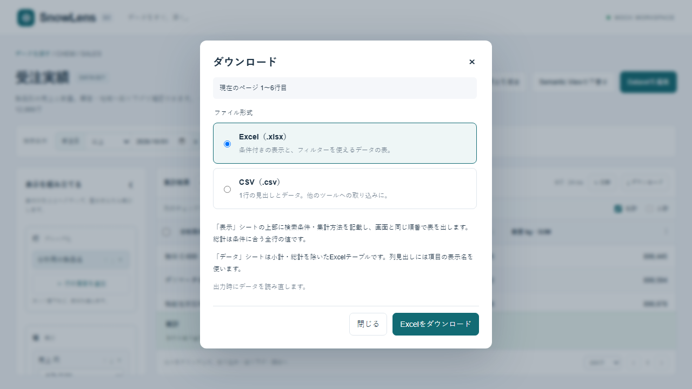
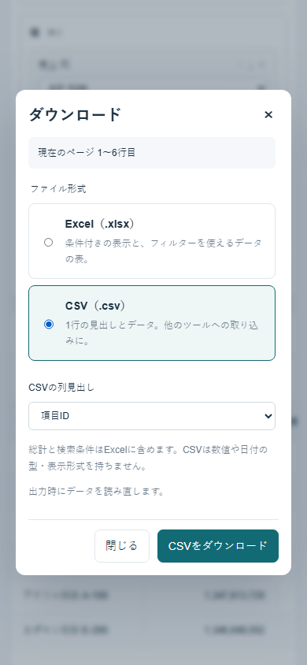
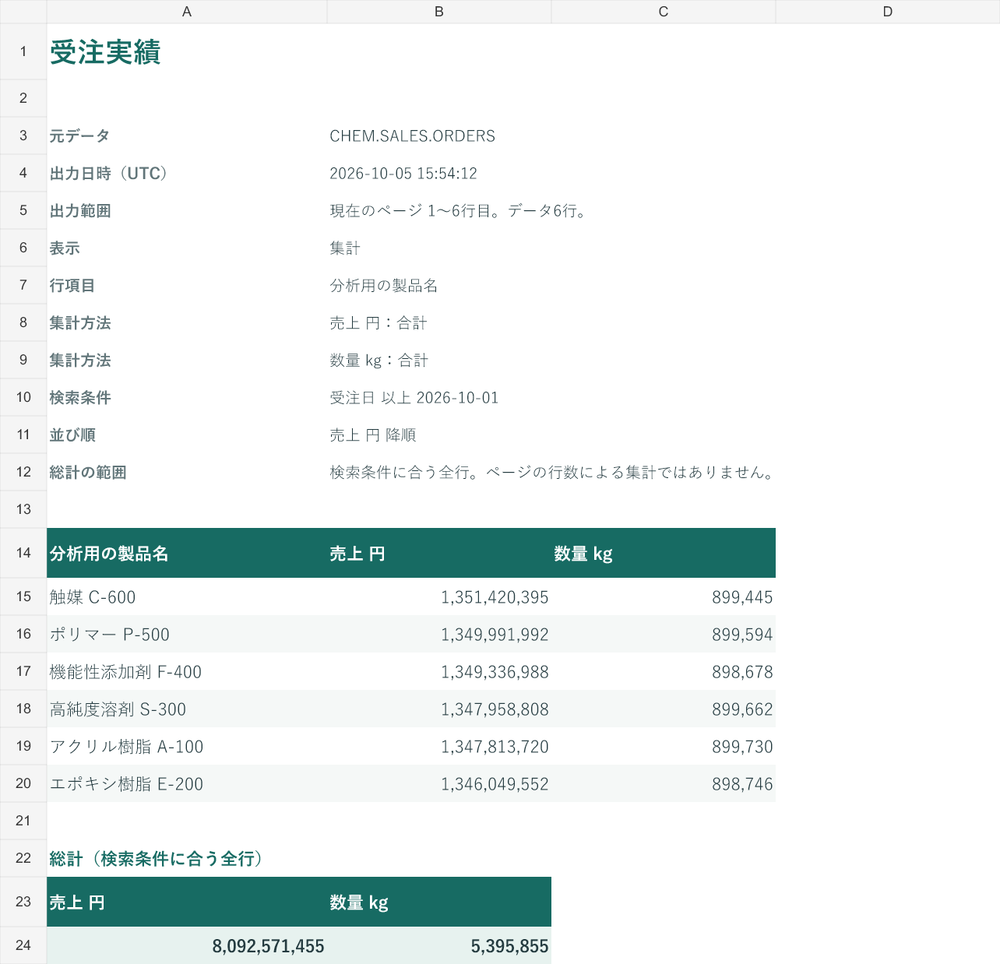

# 表の表示とダウンロード

## 現在の出力

結果の「ダウンロード」でExcelとCSVを選びます。出力するのは現在のページです。操作時に元データ、Datasetの対象項目、結合先、利用者の権限を確認して再実行します。画面を開いた時点とのスナップショットは保証しません。

Excelの「表示」シートは、上部に元データ、出力日時、出力範囲、結合、行項目、集計方法、検索条件、並び順を置きます。その下に画面と同じ順番の表を出します。小計は色と「小計」の文字で示します。総計は条件に合う全行から計算した値を別の欄に出し、ページの合計とは区別します。総計を取得できなかった場合は、その理由を残します。

複合キーはすべての組み合わせを上部に出します。元データと結合先の対象条件は「結合前」と明記し、結合した結果の検索条件と分けます。列名は操作時に確認した表示名を使います。CSVのデータ行にはこれらの条件を混ぜません。

「データ」シートは現在のページの通常行だけをExcelテーブルにします。小計・総計を混ぜず、フィルターやコピー、別の処理への取り込みに使える形です。集計表示なら、通常行も行項目ごとに集計済みです。元の明細ではありません。平均や種類数をExcel側で再集計するときは、集計済みの値を足して全体の値を求めないようにします。

列見出しにはDatasetと個人定義の表示名を使います。SQLの結果名やSUM・AVGは付けません。同じ表示名の列が複数ある場合だけ「金額（合計）」「金額（平均）」のように区別し、同名が残る場合は番号を付けます。集計方法は表示シートの上部で確認できます。

数値・真偽値は型を保ち、DATEの値はExcelの日付にします。時刻とタイムゾーンを失わないため、タイムスタンプは取得した文字列を保ちます。先頭ゼロや大きな整数を含む文字列の識別子を数値へ変換しません。空欄と0を区別し、文字列を数式として書き込みません。Excelのセル上限を超える文字列は切り捨てず、CSVへの切り替えを案内します。Excelは1ページ1,000行、50万セルまでです。

CSVは1行の見出しとデータを出し、表示名と項目IDを選べます。通常行だけを出す初期設定に加え、小計を含めて「行の種類」を付ける出力も選べます。総計や条件をデータ行に混ぜません。UTF-8のBOM、引用符、改行のエスケープに対応し、数式として解釈される文字列は先頭にアポストロフィを付けます。CSVにはセル型がないため、日付やコードの型は取り込み先で指定してください。

従来の`POST /api/query`の`csv: true`は互換性のため残します。項目IDの見出しで、画面の小計行を含み、総計は含まない出力です。新しい画面では`POST /api/export`を使います。

プロダクションビルドのmockで、PCと390px幅のダウンロード操作を確認しました。Excelの画像は、実際にダウンロードしたファイルを読み込んで表示したものです。

## Datalizerで参考にする表組み

Datalizerでは行と列の切り口を使ってクロス集計を作り、複数の集計値を縦に並べる表示も選べます。年度の下に売上金額・数量などが並ぶ表を、値の名前が行に並ぶ形へ切り替えられます。[公式の集計値を縦に並べる例](https://navi.wingarc.com/product/drsum/11174)

Excel出力では、表の位置やシート構成をテンプレートでそろえ、条件や注記も付けられます。出力後に毎回整形する手間を減らす考え方を、SnowLensの条件付き表示とデータ用テーブルに取り入れます。[公式のExcel出力例](https://navi.wingarc.com/product/drsum/28361)

## 次に扱うクロス集計の設計

以下は設計案です。現行の画面と出力は行項目による集計で、2軸のクロス集計やExcelのネイティブPivotTableはまだ生成しません。

表の横に「行」「列」「値」を置き、見えている項目をドラッグして組み立てます。たとえば行に顧客・製品、列に年月、値に金額・数量を置くと、顧客と製品が縦に、年月と値の名前が多段見出しで横に並ぶ形です。行と列を入れ替え、値を横に並べるか縦に並べるかを同じ場所で切り替えます。ドラッグ以外にも追加と移動のボタンを用意します。

多段見出しと同じ値の繰り返しを省く表組みは「表示」で使います。「データ」では各行の顧客・製品・年月を省かず、1行の見出しを保ちます。結合セルは表示用に限定し、取り込み用の表には作りません。CSVでは平坦なデータを出し、階層やセル結合を再現するための空行は挿入しません。

クロス集計の各セル、小計、縦横の総計は、その粒度の元データからSnowflakeで計算します。ページ内の平均を平均したり、種類数を足したりしません。列の種類は現在ページから推測せず、条件に合う対象から確定します。ページは行のグループ単位に分け、1つのグループの列をページ境界で欠落させません。

列が増える場合は、列の種類と生成セル数を先に示します。上限を超える場合は、年月などの条件を絞る操作へつなげます。元データに存在しない組み合わせ、実際の空欄、0を別々に扱い、空欄を自動で0にしません。セマンティック指標の必要な項目や粒度を保てない配置は止めます。

ExcelのPivotTableは、Excel上での再計算と元明細の出力範囲を確認してから別に扱います。集計済みの平均や種類数をPivotTableのSUMでまとめる出力は作りません。
