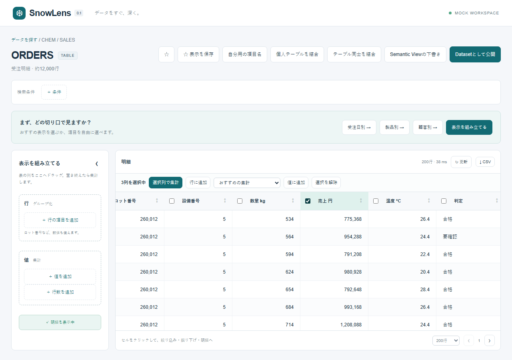
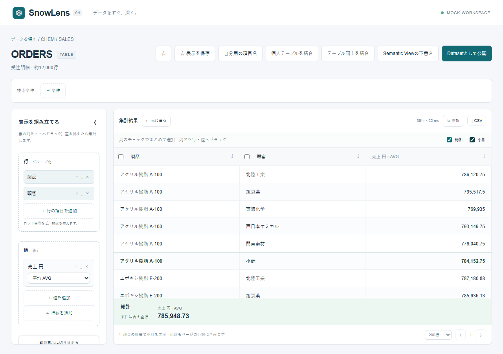
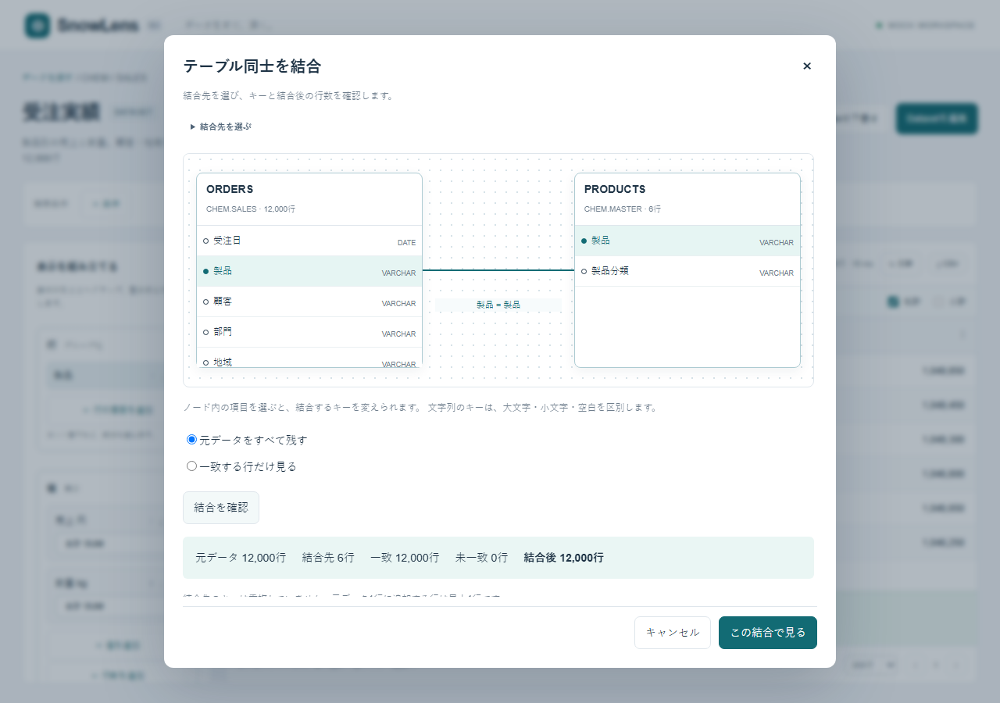
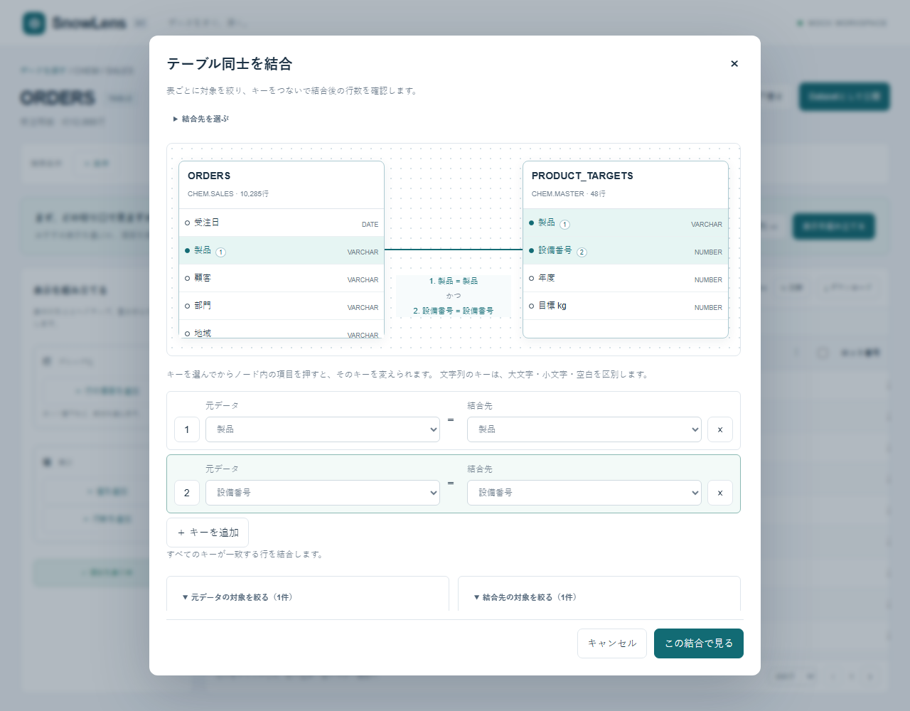
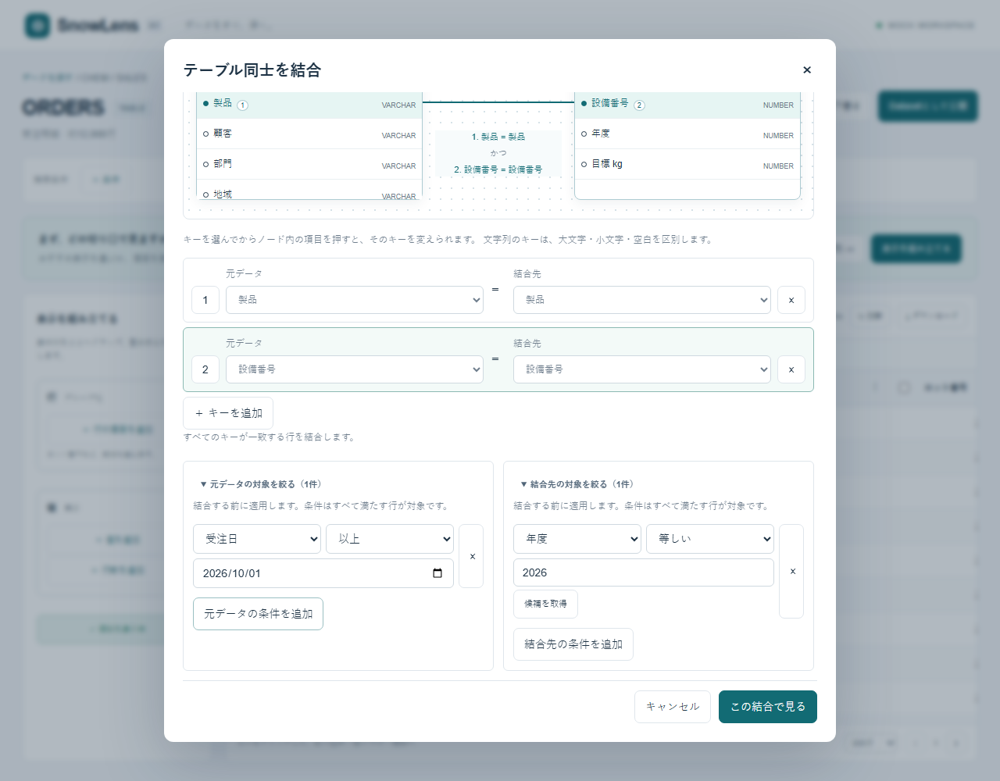
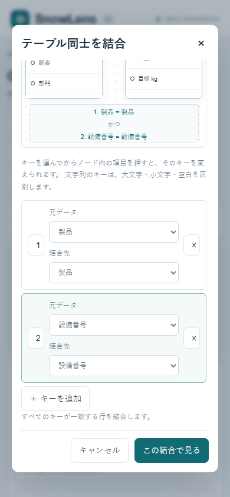

# v0.1 UX and self-review

Reviewed 2026-10-05 using the local production build, in-app browser and Playwright.

## Findings and fixes

- Opening raw sources goes directly to a bounded detail preview with simple
  recommended grouping, rather than a mandatory Dataset or configuration screen.
- Row grouping is labelled 行 / グループ化 and numeric IDs are explicitly eligible.
  Aggregation is an adjacent select on each value, with Japanese labels and SQL names.
- Field search supports type/category/recommendation/recent fields and description.
  The 120-column experiment fixture finds measurement 100 without a checkbox wall.
- Raw drill originally left the cell menu over the field picker. Hide the parent
  menu while choosing the next field, retaining the clicked row context.
- Drill/detail applies the complete grouped row context, and Undo restores the
  prior query. Curated drill suggestions and raw field selection share the same model.
- Keep the grid visible during loading. Disable stale cell actions while updating.
  Live errors remove previous results; mock retry tests retain the preview.
  Filter edits debounce 180ms and cancel prior requests.
- Keep raw recommendations available while paging/sorting detail rows. Once a
  grouping/value is chosen, retire the introductory prompt.
- Add stable secondary sort fields to avoid jumping between ties on different pages.
- Demo month generation originally correlated a product exclusively to September;
  generate dates across products so a normal October filter still exercises drill.
- Separate disposable E2E metadata and port from the user's local mock workspace.
- A missing metadata store must not hide otherwise accessible raw data. Load the
  catalog independently and surface save-storage failure as a notice.
- Dataset recommendation edits now feed field selection. Dataset publication and
  personal saves have separate Snowflake table privileges.
- Production startup uses ordinary Next.js output to match `npm start` in App Runtime.
- Reset page scroll when opening a source or returning home so the result heading
  and conditions stay visible after browsing a long source list.
- On desktop, keep the exploration workspace within the viewport with independent
  scrolling for settings and results; on phones use a stacked page layout.
- Republishing an existing Dataset now refreshes the active query, so unpublished
  detail columns disappear immediately without requiring the user to refresh.

## Validation scope

Automated UI journeys cover raw and curated filters → aggregation → sorting →
drill → detail → Undo; saved-view reload; numeric grouping; owner publishing;
favorite; CSV download; all four relation kinds in mock mode; row virtualization;
pagination; empty result; retained result while loading; retry after a query error;
390px responsive width; invalid API input and dataset field scope enforcement.
An additional regression edits field exposure in an already-published detail Dataset.

Unit tests cover SHOW metadata parsing, inference, native Semantic View aliases,
pre-aggregation filtering without accidental grain changes, logical validation,
all ordinary aggregations, bound values/quoted identifiers, null operators,
pagination bounds, Dataset validation, Saved View serialization, caller-token
requirements, CSV escaping and bounded request bodies.

## Known limits / follow-ups

- No connected Snowflake account or Snowflake CLI was available for live deployment.
  Real caller grants, masking/row policies, semantic relationships and cancellation
  must be checked in an enabled account using the two-user deployment checklist.
- Catalog browsing uses 100-object pages within a database/schema and a 15-second
  caller/role-scoped cache. Source/query authorization is freshly checked.
- CSV is the current bounded page, not an unbounded extract.
- Semantic detail without a Dataset fact mapping shows dimension combinations.
  Mapped physical detail and metric compatibility are implemented, but require
  verification against a live Snowflake account.
- Mock mode is one local user. Production state uses Snowflake storage and RBAC.
- Offset pagination is not a consistent snapshot while data changes.
- Modal focus trapping, URL/shareable query state and Dataset/saved-definition
  conflict handling remain follow-ups. Personal-table edits and deletes already
  use versions; standard Snowflake table insertion races still need live evidence.
- `npm audit --omit=dev` has no production vulnerabilities. Full audit currently
  reports a braces issue inherited by the Next.js ESLint toolchain; no patched
  compatible dependency is available. Do not lint untrusted projects with this setup.

## Datalizer-inspired follow-up

- Filter candidates are loaded on demand, capped at 100, constrained by other
  conditions and cancelled when stale. Direct input remains available.
- Aggregate cells offer "この数字の明細を見る" and omit invalid equality actions.
- Live catalog browsing expands database/schema/kind instead of scanning an account.
- Semantic physical detail opens over the aggregate, with a fixed-height scrollable
  grid and persistent close/pagination controls.
- Primary references: [filter candidates](https://navi.wingarc.com/product/drsum/28389),
  [hierarchical conditions](https://navi.wingarc.com/product/drsum/9396),
  [drill preview](https://navi.wingarc.com/product/drsum/28385).
- In-place hierarchy expansion and cross-tab layout remain later enhancements;
  neither is claimed as implemented in this follow-up.

## Private composition follow-up

Verified typed spreadsheet paste, personal LEFT/INNER lookup, unmatched rows,
duplicate rejection, saved joins using the latest private table version, and private
field names/descriptions. General two-node joins show exact row growth before
Apply and reject a 24-million-row fanout in the synthetic example. Publication
downloads a selected-field DDL draft; no publication or role grant is performed.

Visible detail columns can be selected in bulk or dragged to the builder. Dragging
keeps detail visible until Apply, preventing the next needed column from disappearing.
Batch pickers and ordering buttons provide keyboard/touch alternatives. AVG and
distinct subtotals are calculated at their own grain. Grand totals ignore page
offset, keep filters/joins and stay in a fixed result footer. A real NULL group and
its subtotal remain distinct in the grid and CSV. Subtotal cells cannot drill.
The view saves grouping order, aggregate methods and total preferences together.

Production-build Playwright journeys cover these interactions and 390px screens.
Screenshots live under the ignored `artifacts/` folder. Unit checks also exercise
identity-free storage write arguments, hostile bound private values, exact join
count arithmetic, snapshot uniqueness checks, and invalid composed field sets.
Direct SQL storage and principal checks now have separate live evidence. App
Runtime tokens, two-user lifecycle and runtime policy checks remain outstanding;
Issue #5 remains open. See the [connected-account record](snowflake-validation.md).

Screenshots use synthetic mock data, not a connected account:

## Composite keys and pre-join filters

The two-node builder accepts 1–12 key pairs and optional filters on each input.
All pairs must match. A synthetic yearly target table demonstrates that adding
product + machine keys alone still leaves 48 duplicated tuples; selecting one
year makes the lookup unique. A source date filter then reduces 12,000 orders to
10,285 before joining. The preview uses the filtered inputs and excludes result
filters. Editing a key or condition clears the preview and disables Apply.

Private save/reopen retains both key pairs and both input conditions. Excel places
each pair and each node's conditions above the report, separately from result
filters; CSV stays data-only. Publication with private input conditions is blocked
with a shared-View instruction. Existing one-key saved views remain compatible.

The production-build journey covers these operations at 1280px and 390px. Mobile
keys stack vertically and the node condition uses a full-width caption. Fixed
footer controls remain visible. Direct Snowflake SQL and restricted-caller
procedure tests verify counts, NULL handling, snapshot duplicate detection and
rights revocation; they do not establish App Runtime safety.

